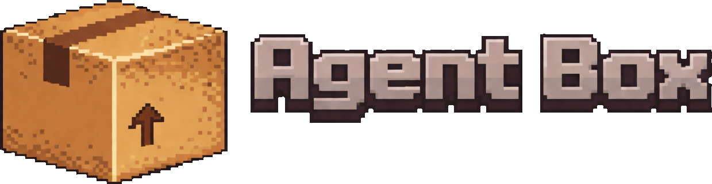

# AgentBox

<p align="left">
  
</p>

CLI for running AI agents (Claude Code, GitHub Copilot, OpenAI Codex, Cursor CLI, OpenCode, Ralphex) inside an isolated Docker container.

- [Why use Agentbox?](#why-use-agentbox)
- [Installation](#installation)
  - [Shell Completions](#shell-completions)
- [Updating](#updating)
- [How to Use](#how-to-use)
  - [Modular Sandbox Configuration](#modular-sandbox-configuration)
  - [Customization](#customization)
- [Development](#development)

## Why use Agentbox?

- **Security** — agents run in a sandbox and cannot access files outside the project, modify system configs, or cause unintended side effects
- **Convenience** — no need to approve every agent action since it works in an isolated environment

## Installation

Download the latest release from [releases](https://github.com/aleksey925/agentbox/releases) and install it manually
or you can run the following commands to install the latest version to `~/.local/bin`:

```bash
VERSION=$(curl -sL -o /dev/null -w '%{url_effective}' https://github.com/aleksey925/agentbox/releases/latest | sed 's/.*\/v//')
OS=$(uname -s | tr '[:upper:]' '[:lower:]')
ARCH=$(uname -m | sed 's/x86_64/amd64/;s/aarch64/arm64/')
curl -#L "https://github.com/aleksey925/agentbox/releases/download/v${VERSION}/agentbox_${VERSION}_${OS}_${ARCH}.tar.gz" | tar xz -C ~/.local/bin agentbox
```

Also, you can [build from source](#build).

### Shell Completions

Agentbox supports shell completions for Bash and Zsh. To enable them, add one of the following
lines to your shell configuration:

```bash
# Bash: add to ~/.bashrc
eval "$(agentbox completion bash)"

# Zsh: add to ~/.zshrc
eval "$(agentbox completion zsh)"
```

If you use an alias for agentbox, pass the alias name as the second argument:

```bash
# For alias "abox"
alias abox="agentbox"
eval "$(agentbox completion bash abox)"
```

## Updating

Agentbox can update itself. Run `agentbox self update <version>` to update to a specific version,
or use `agentbox self update <tab>` to choose a version and install it.

## How to Use

```bash
cd your-project
agentbox init    # set up sandbox (configure presets on first run) and download agents for first time
agentbox run     # start sandbox
```

By default agents run with no extra flags. To always launch an agent with specific
flags — for example to bump verbosity, pin a model, or enable a permissive mode —
configure them globally:

```bash
agentbox agent flags          # open the flags file in $EDITOR
agentbox agent flags --show   # print current flags
agentbox agent flags --path   # print the flags file path
```

The flags file (`~/.agentbox/flags/agent-flags`) is global and read live on every
launch: edits apply to the next agent run — even inside a running sandbox — with no
image rebuild. One line per agent, `*` applies to any agent without its own line:

```
claude --verbose
cursor --no-color
* --some-shared-flag
```

Each agent's own flags are documented in its CLI (`<agent> --help`); agentbox just
forwards whatever you put here.

Your project is mounted at `/home/box/app`.

**Git Configuration**

Your `~/.gitconfig` is automatically mounted into the sandbox (read-only), so git commits work
with your identity. If you haven't configured git globally yet, run:

```bash
git config --global user.name "Your Name"
git config --global user.email "your@email.com"
```

**Other Commands**

| Command                         | Description                       |
| ------------------------------- | --------------------------------- |
| `agentbox run --build`          | Rebuild and run sandbox           |
| `agentbox run --build-no-cache` | Full rebuild without cache        |
| `agentbox ps`                   | List running sandboxes            |
| `agentbox attach`               | Attach to running sandbox         |
| `agentbox clean`                | Remove sandbox files from project |

**Managing Agents**

Agent binaries are managed separately from the sandbox:

```bash
agentbox agent                      # show installed vs latest versions
agentbox agent update               # update all agents
agentbox agent update claude        # update specific agent
agentbox agent use claude 2.0.67    # switch to specific version
agentbox agent flags                # edit flags agents are launched with
```

### Modular Sandbox Configuration

Sandbox configuration is modular — it consists of a core config (`core.v1.yml`) plus environment
presets (like `go.v1.yml`) you select during `agentbox init`. Presets mount tool caches from your
host into the sandbox, so dependencies aren't re-downloaded on every run.

Available presets: `Go`, `Python`.

### Customization

Agentbox stores your sandbox configuration in `~/.agentbox/skeleton/`:

```
~/.agentbox/skeleton/           # your global skeleton (you own this)
├── core.v1.yml                 # base sandbox config
├── go.v1.yml                   # Go preset (if selected)
├── python.v1.yml               # Python preset (if selected)
├── Dockerfile.v1.agentbox      # sandbox Dockerfile
└── local.yml                   # template for project customizations
```

You can freely edit any files in skeleton — they will be copied to projects on `agentbox init`.

#### Project Configuration

Each project gets a `.agentbox/` directory copied from your skeleton:

```
project/.agentbox/
├── core.v1.yml
├── go.v1.yml
├── Dockerfile.v1.agentbox
└── local.yml                   # project-specific overrides (never overwritten)
```

- **`local.yml`** — add project-specific settings here, this file is never overwritten
- All `.yml` files are automatically merged when running the sandbox

#### Updating Configuration

| Task                                                                           | Command                          |
| ------------------------------------------------------------------------------ | -------------------------------- |
| Reinit project from skeleton                                                   | `agentbox init`                  |
| Update presets, change selected presets, or recreate the skeleton from scratch | `agentbox init skeleton --force` |

When you run `agentbox init`, files in `<project>/.agentbox/` are replaced with current skeleton
(except `local.yml` which is preserved).

## Development

### Prerequisites

- [mise](https://mise.jdx.dev/getting-started.html#installing-mise-cli) for managing toolchains

### Set up environment

- install toolchains and deps

  ```bash
  mise trust && mise install
  make deps
  ```

- verify the setup by running tests

  ```bash
  make test
  ```

### Build

Two options:

- `make build` — builds the binary into `dist/`.
- `make install` — builds and installs the binary to `~/.local/bin`.
  Ensure this directory is in your `PATH`:

  ```bash
  export PATH="$HOME/.local/bin:$PATH"
  ```
